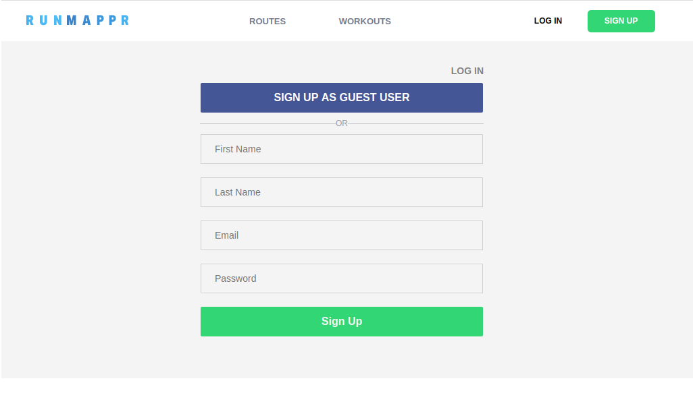
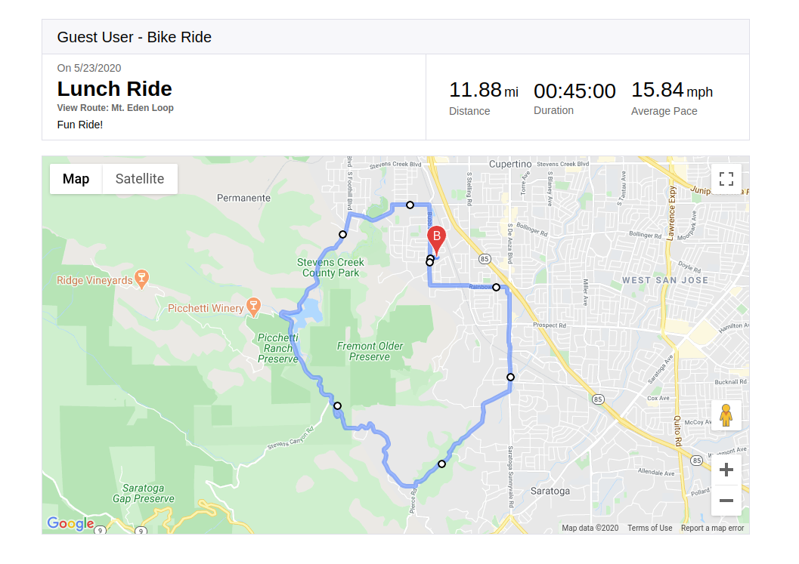
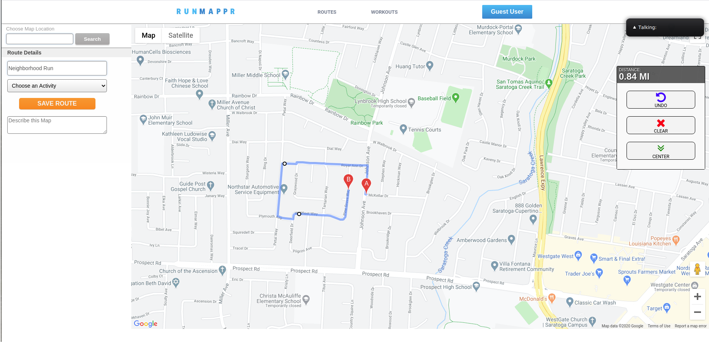

# 

RunMappr is a workout tracking app aimed at endurance sports. It allows users to create maps of their running/biking/hiking routes over the google maps API and save them for future reference. Saved routes can then be logged as workouts using the itegrated workout tracker. Logged workouts automatically calculate average pace in units based on the activity.  

## Live Link: https://run-mapper.herokuapp.com/

## Technology stack

* Backend: Ruby on Rails

* Frontend: React/Redux

* Mapping software: Google Maps API

## Front End

### User Profiles



Users can create profiles to sign in to the app from the main page. A demo user is also availible for viewing the app's features before signing up.


### Dashboard


On login, users are routed to their dashboard. The dashboard has tabs for viewing both saved routes and their workout log, as well as links on both pages to create a new route or log a new workout respectively. The user can also delete routes and workouts from the dashboard view.

### Route Show Page


Clicking on a route in the dashbaord directs the user to a detailed show view of the route. Users can view the route map as well as Google directions by pressing the "Show Directions" button. From this view, pressing the "Log as Workout" button redirects the user to the workout logger with the current route already selected.

### Workout Show page



Clicking on a workout in the dasboard directs the user to a detailed view of their workout. From here, clicking the "View Route" button redirects to the associated route's show page where they can view route info and log another workout. Depending on the type of workout, "Average Pace" will be displayed as either minutes/mile (Running, Walking, Hiking, Other) or MPH (Biking).

### Route Creator



The route creator is accessible from the dashboard "Routes" tab by clicking "Create Route", and also from the main nav header by hovering over "Routes" and clicking the "Create Route" button in the dropdown. The map can be centered on any location in the world by using the search bar in the top left. Routes are built by clicking the map to add a waypoint to that spot. A path is automatically calculated between the previous waypoint and the one just added. The route and total distance are dynamically displayed as more waypoints are added. If the user makes a mistake, the widget on the right contains "Undo" and "Clear" buttons which will remove the last waypoint or clear the map, respectively. The "Center" button re-centers the map over the currently drawn route if one exists, otherwise it does nothing. Finally, users can select the primary activity type for the route, add a description if desired, and hit "Save Route". 

### Workout Logger


The workout logger is accessible from the dashboard "Workouts" tab or from the main nav header by hovering over "Workouts" and clicking "Log Workout". It can also be accessed directly from a route's show page, in which case the "Route" field will be autofilled with that particular route. 

## Key Features

### Route Creation
The route creator is the heart of Runmappr. It functions using the google maps API. At its core, the mapper runs off of one simple callback and event listener:

``` Javascript
  // Display a Google Map on the DOM element this.mapnode

        this.map = new google.maps.Map(this.mapNode, mapOptions);

    // Add and event listener to the map to add a waypoint on click

        this.map.addListener('click', this.addWaypoint);
```
The google maps API supports event listeners on the map itself. In this case, we used the 'click' event to trigger a function that adds a new waypoint to the route:

``` Javascript 
    addWaypoint(e){ 
        
        let lat = e.latLng.lat();
        let lng = e.latLng.lng();

        let coords = {lat:lat, lng:lng}; 
        
        // Add coordinates to waypoints list
        this.routeCoordinates.push(coords); 
        
        //Update the route polyline
        this.updatePath();         
    }
```
The function `updatePath()` takes our current list of waypoint coordinates (`routeCoordinates`) and queries the google maps directions API to generate a route that will link them all together in order. The API returns an object containing detailed data about the route. `updatePath()` then calls another function, `renderRoute()`, to parse the resulting route data and render it on the map. 

``` Javascript

// Create the google maps directions API interface

    this.dirService = new google.maps.DirectionsService();

 // Requests new directions and renders them
    updatePath() {

        // First, map the route coordinates into google maps Waypoint literals

        let waypoints = this.routeCoordinates.map((waypoint)=> {
            return {
                location: waypoint,
                stopover: false 
               
            }
        }).slice(1, this.routeCoordinates.length -1); 
        

        // Define the route options for the new path, passing in our list of waypoints

        let routeOpts = {
            origin: this.routeCoordinates[0],
            destination: this.routeCoordinates[this.routeCoordinates.length -1],
            travelMode: google.maps.DirectionsTravelMode.WALKING,
            waypoints: waypoints, 
        }

      // If there are one or more waypoints in the route, 
      // make a google directions API request and render the result 
      
        if(this.routeCoordinates.length > 0){

            this.dirService.route(routeOpts ,this.renderRoute);

        } 
       
    }

```

## Future Direction

* Allow routes to be searchable by location, activity type, and name

    * Allow users to bookmark routes made by other users and log them as workouts
    * Allow users to set the privacy of created routes to public or private

* Add elevation data to routes

* Add a user dashboard to track workout stats (total miles by activity, total number of workouts logged, etc)

* Add commenting on public routes


